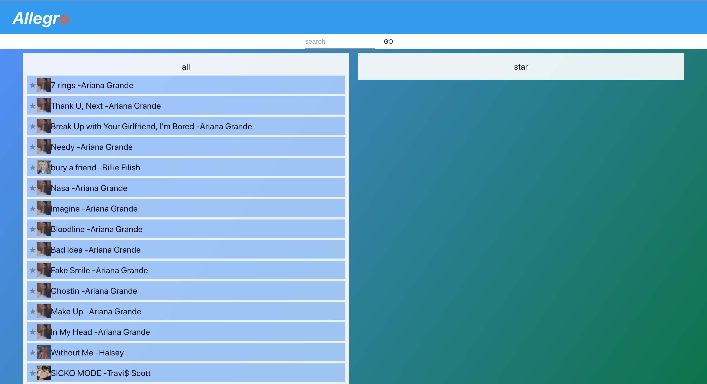
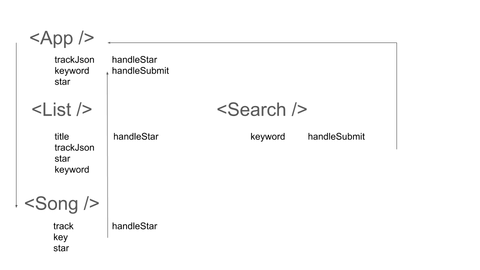

# Allegro

Hello! This readme will explain the structure of Allegro, a music library implemted using React. 
Click this link to look at the application! 
[Allegro](https://christttto.github.io/music-library/) 

## Main Requirements

1. Ability to scroll through all the songs
2. Ability to star a song (unstar)
3. Access to a seperate list with only the starred songs
4. Ability to search for a song

## Solution

1. Provide a list that will be populated using data from json
2. Provide a blank star for user to click to star a song
   1. Starred song will have active star next to it, to indicate that the song is starred
   2. Clicking an active star will unstar a song
3. Populate a list with songs that has been saved as star
4. When populating a list, use json data that matches the keyword that has been entered

## Structure

App component will house List components and Search component.  
List component will take in title, trackJson, array of stars, search keyword, and functions to call when changes have been made.  
Song component will take in mapped trackJson, and use the song name, artist name, and based on the array of star, conditionally render star to be in color or not.  
Search component will return the keyword state of App component, which will be sent down to list to conditionally map Song depending on the keyword.

## Improvements

1. Refacotring List component. As playlist extends, it will be better to take in parameter from parent, and simply map at List level.
2. Implement using Clojure Script!
3. Utilize muid of json, which was empty.

### `npm start`

Runs the app in the development mode. 
Open [http://localhost:3000](http://localhost:3000) to view it in the browser.
